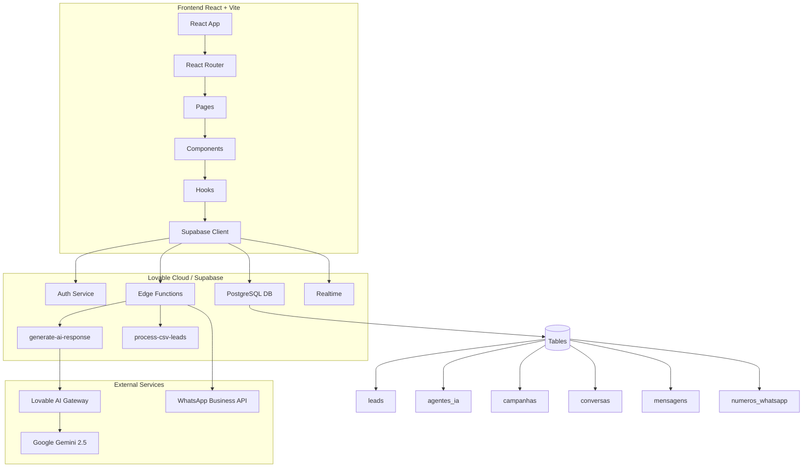

# 📚 Documentação Técnica - Sistema de Automação WhatsApp com IA

## 1. Visão Geral do Projeto

### Nome do Projeto
**WhatsApp AI Automation Platform** - Plataforma de Automação de Conversas WhatsApp com Inteligência Artificial

### Finalidade
Sistema completo para automação de prospecção, engajamento e qualificação de leads através do WhatsApp, utilizando agentes de IA personalizáveis para conduzir conversas naturais e inteligentes em escala.

### Problemas Resolvidos
- ✅ Automação de prospecção ativa via WhatsApp
- ✅ Qualificação automatizada de leads
- ✅ Gestão centralizada de múltiplas campanhas
- ✅ Conversas personalizadas em escala
- ✅ Análise de performance e métricas em tempo real

### Stack Tecnológico

#### Frontend
- **React 18.3.1** - Biblioteca UI
- **TypeScript** - Tipagem estática
- **Vite** - Build tool e dev server
- **Tailwind CSS** - Framework CSS utility-first
- **shadcn/ui** - Componentes UI
- **React Router DOM 6.30.1** - Roteamento SPA
- **React Query (TanStack Query 5.83.0)** - Gerenciamento de estado assíncrono
- **Zod 3.25.76** - Validação de schemas
- **date-fns 3.6.0** - Manipulação de datas

#### Backend (Lovable Cloud / Supabase)
- **Supabase** - BaaS (Backend as a Service)
  - PostgreSQL - Banco de dados relacional
  - Row Level Security (RLS) - Segurança granular
  - Realtime - Subscriptions em tempo real
  - Edge Functions (Deno) - Serverless functions
- **Lovable AI Gateway** - Integração com modelos de IA
  - Google Gemini 2.5 Flash (padrão)
  - OpenAI GPT-5 (opcional)

#### Integrações
- WhatsApp Business API (planejado)
- Lovable AI Gateway (ativo)
- CSV Import/Export

---

## 2. Arquitetura

### Diagrama de Estrutura



### Estrutura de Módulos

```
src/
├── components/          # Componentes reutilizáveis
│   ├── ui/             # Componentes UI base (shadcn)
│   ├── Layout.tsx      # Layout principal com sidebar
│   ├── StatCard.tsx    # Card de estatísticas
│   ├── LoadingState.tsx
│   ├── ErrorState.tsx
│   ├── EmptyState.tsx
│   ├── LeadImportDialog.tsx
│   ├── AgentFormDialog.tsx
│   ├── WhatsAppConnectDialog.tsx
│   └── CampaignFormDialog.tsx
│
├── pages/              # Páginas da aplicação
│   ├── Dashboard.tsx   # Visão geral
│   ├── Leads.tsx       # Gestão de leads
│   ├── Agents.tsx      # Configuração de agentes IA
│   ├── WhatsApp.tsx    # Números WhatsApp
│   ├── Campaigns.tsx   # Campanhas
│   ├── Reports.tsx     # Relatórios
│   └── Settings.tsx    # Configurações
│
├── hooks/              # React Query hooks
│   ├── useLeads.ts
│   ├── useAgents.ts
│   ├── useCampaigns.ts
│   ├── useWhatsAppNumbers.ts
│   ├── useConversations.ts
│   └── useDashboardMetrics.ts
│
├── integrations/
│   └── supabase/
│       ├── client.ts   # Cliente Supabase configurado
│       └── types.ts    # TypeScript types do DB
│
└── App.tsx             # Root component + routing

supabase/
├── functions/          # Edge Functions (Deno)
│   ├── generate-ai-response/
│   │   └── index.ts
│   └── process-csv-leads/
│       └── index.ts
│
└── migrations/         # Migrações de banco de dados
    └── *.sql
```

### Fluxo Geral de Funcionamento

1. **Autenticação**
   ```
   User → AuthPage → Supabase Auth → JWT Token → Protected Routes
   ```

2. **Importação de Leads**
   ```
   CSV Upload → LeadImportDialog → process-csv-leads Edge Function → 
   → Validação → Supabase DB (leads table) → RLS Check → Success
   ```

3. **Criação de Campanha**
   ```
   User → CampaignFormDialog → useCampaigns hook → Supabase DB → 
   → RLS Policies → Campanha criada → Realtime update
   ```

4. **Conversa com IA**
   ```
   Lead Message → conversas table → generate-ai-response Edge Function →
   → Lovable AI Gateway → Gemini 2.5 Flash → Response → mensagens table →
   → Realtime → UI Update
   ```

---

## 3. Instalação e Configuração

### Requisitos Mínimos

- **Node.js**: 18.0.0 ou superior
- **npm/yarn/bun**: Gerenciador de pacotes
- **Navegador**: Chrome, Firefox, Safari ou Edge (versões recentes)
- **Conta Lovable**: Para Lovable Cloud (backend)

### Comandos de Instalação

```bash
# 1. Clone o repositório
git clone <repository-url>
cd whatsapp-ai-automation

# 2. Instale as dependências
npm install
# ou
yarn install
# ou
bun install

# 3. Configure as variáveis de ambiente
# (Automático via Lovable Cloud)

# 4. Execute em desenvolvimento
npm run dev
# ou
yarn dev
# ou
bun dev

# 5. Build para produção
npm run build
# ou
yarn build
# ou
bun build
```

### Variáveis de Ambiente (.env)

**⚠️ IMPORTANTE**: Este projeto usa Lovable Cloud, que configura automaticamente as variáveis de ambiente. Você **não precisa** criar um arquivo `.env` manualmente.

As seguintes variáveis são injetadas automaticamente:

```bash
# Supabase Configuration (Auto-configurado)
VITE_SUPABASE_URL=https://mnkoedggnqqbziryiuyz.supabase.co
VITE_SUPABASE_PUBLISHABLE_KEY=eyJhbGci...
VITE_SUPABASE_PROJECT_ID=mnkoedggnqqbziryiuyz

# Lovable AI (Auto-configurado no backend)
LOVABLE_API_KEY=<auto-generated>

# Supabase Backend Secrets (Edge Functions)
SUPABASE_URL=<auto-configured>
SUPABASE_ANON_KEY=<auto-configured>
SUPABASE_SERVICE_ROLE_KEY=<auto-configured>
SUPABASE_DB_URL=<auto-configured>
```

### Portas e URLs Padrão

- **Desenvolvimento Local**: `http://localhost:5173`
- **Preview Lovable**: `https://<project-id>.lovableproject.com`
- **Produção**: Configurável via domínio customizado
- **Supabase API**: `https://mnkoedggnqqbziryiuyz.supabase.co`
- **Edge Functions**: `https://mnkoedggnqqbziryiuyz.supabase.co/functions/v1/<function-name>`

---

## 4. Banco de Dados

### Esquema de Tabelas

#### 📋 **leads**
Armazena informações dos leads/contatos

| Campo | Tipo | Descrição | Constraints |
|-------|------|-----------|-------------|
| `id` | uuid | Identificador único | PK, DEFAULT gen_random_uuid() |
| `user_id` | uuid | ID do usuário proprietário | FK, NOT NULL |
| `nome` | text | Nome do lead | NULLABLE |
| `numero_telefone` | text | Telefone (formato: +5511999999999) | NOT NULL |
| `email` | text | Email do lead | NULLABLE |
| `empresa` | text | Nome da empresa | NULLABLE |
| `status` | lead_status | Status do lead | DEFAULT 'contatado' |
| `informacoes_adicionais` | jsonb | Dados extras personalizados | DEFAULT '{}' |
| `data_cadastro` | timestamptz | Data de cadastro | DEFAULT now() |
| `created_at` | timestamptz | Data de criação | DEFAULT now() |
| `updated_at` | timestamptz | Data de atualização | DEFAULT now() |

**Enum `lead_status`**: `'contatado'`, `'em_conversa'`, `'convertido'`, `'desqualificado'`

**RLS Policies**:
- ✅ Users can view own leads
- ✅ Users can insert own leads
- ✅ Users can update own leads
- ✅ Users can delete own leads

#### 🤖 **agentes_ia**
Configuração dos agentes de IA

| Campo | Tipo | Descrição |
|-------|------|-----------|
| `id` | uuid | Identificador único |
| `user_id` | uuid | ID do usuário proprietário |
| `nome` | text | Nome do agente |
| `objetivo_campanha` | text | Objetivo/meta do agente |
| `conhecimento_contexto` | text | Contexto e conhecimento base |
| `identidade_prompt` | text | Personalidade e estilo |
| `tom_comunicacao` | agent_tone | Tom de comunicação |
| `perguntas_personalizacao` | jsonb | Perguntas de qualificação |
| `status` | agent_status | Status (ativo/inativo) |
| `created_at` | timestamptz | Data de criação |
| `updated_at` | timestamptz | Data de atualização |

**Enum `agent_tone`**: `'amigavel'`, `'profissional'`, `'casual'`, `'formal'`
**Enum `agent_status`**: `'ativo'`, `'inativo'`

#### 📱 **numeros_whatsapp**
Números WhatsApp conectados

| Campo | Tipo | Descrição |
|-------|------|-----------|
| `id` | uuid | Identificador único |
| `user_id` | uuid | ID do usuário proprietário |
| `numero` | text | Número WhatsApp |
| `nome_exibicao` | text | Nome de exibição |
| `status` | whatsapp_status | Status da conexão |
| `api_token` | text | Token da API WhatsApp |
| `webhook_url` | text | URL do webhook |
| `limite_mensal` | integer | Limite de mensagens/mês |
| `mensagens_enviadas_mes` | integer | Contador mensal |
| `ultima_conexao` | timestamptz | Última conexão |

**Enum `whatsapp_status`**: `'conectado'`, `'desconectado'`, `'erro'`

#### 🎯 **campanhas**
Campanhas de prospecção

| Campo | Tipo | Descrição |
|-------|------|-----------|
| `id` | uuid | Identificador único |
| `user_id` | uuid | ID do usuário proprietário |
| `nome` | text | Nome da campanha |
| `agente_ia_id` | uuid | ID do agente IA |
| `tipo` | campaign_type | Tipo de campanha |
| `status` | campaign_status | Status atual |
| `filtros_leads` | jsonb | Filtros de segmentação |
| `configuracao_agendamento` | jsonb | Config de agendamento |
| `metricas` | jsonb | Métricas da campanha |
| `data_inicio` | timestamptz | Data de início |
| `data_fim` | timestamptz | Data de fim |

**Enum `campaign_type`**: `'prospeccao_ativa'`, `'engajamento'`, `'reativacao'`, `'qualificacao'`
**Enum `campaign_status`**: `'rascunho'`, `'em_execucao'`, `'pausada'`, `'concluida'`

#### 💬 **conversas**
Conversas entre leads e agentes

| Campo | Tipo | Descrição |
|-------|------|-----------|
| `id` | uuid | Identificador único |
| `lead_id` | uuid | ID do lead |
| `agente_ia_id` | uuid | ID do agente |
| `numero_whatsapp_id` | uuid | ID do número WhatsApp |
| `campanha_id` | uuid | ID da campanha |
| `status` | conversation_status | Status da conversa |
| `tipo` | conversation_type | Tipo de conversa |
| `contexto_conversa` | jsonb | Contexto e histórico |
| `ultima_mensagem_em` | timestamptz | Timestamp última msg |

#### 📨 **mensagens**
Mensagens individuais das conversas

| Campo | Tipo | Descrição |
|-------|------|-----------|
| `id` | uuid | Identificador único |
| `conversa_id` | uuid | ID da conversa |
| `remetente` | message_sender | Quem enviou |
| `conteudo` | text | Conteúdo da mensagem |
| `tipo` | message_type | Tipo (texto/imagem/audio) |
| `status_entrega` | message_status | Status de entrega |
| `gerada_por_ia` | boolean | Se foi IA ou manual |
| `metadata` | jsonb | Metadados extras |
| `timestamp` | timestamptz | Data/hora |

**Enum `message_sender`**: `'lead'`, `'ia'`, `'usuario'`

### Funções do Banco de Dados

#### `handle_new_user()`
Trigger automático ao criar novo usuário:
- Cria perfil em `profiles`
- Atribui role `admin` ao primeiro usuário
- Atribui role `operator` aos demais

#### `update_updated_at_column()`
Atualiza automaticamente `updated_at` em:
- leads
- agentes_ia
- campanhas
- conversas
- profiles

#### `has_role(user_id, role)`
Verifica se usuário tem determinada role

---

## 5. Edge Functions (Serverless)

### 🤖 **generate-ai-response**

**Localização**: `supabase/functions/generate-ai-response/index.ts`

**Descrição**: Gera respostas de IA para conversas com leads usando o Lovable AI Gateway (Gemini 2.5 Flash).

**Método**: `POST`

**Endpoint**: 
```
https://mnkoedggnqqbziryiuyz.supabase.co/functions/v1/generate-ai-response
```

**Request Body**:
```json
{
  "conversaId": "uuid-da-conversa",
  "mensagemLead": "mensagem do lead"
}
```

**Response Success** (200):
```json
{
  "response": "resposta gerada pela IA"
}
```

**Response Error** (500):
```json
{
  "error": "mensagem de erro"
}
```

**Fluxo Interno**:
1. Valida `conversaId` e `mensagemLead`
2. Busca informações da conversa, lead e agente
3. Busca histórico de mensagens
4. Constrói prompt do sistema com contexto do agente
5. Chama Lovable AI Gateway
6. Salva mensagem do lead e resposta da IA
7. Retorna resposta

**Variáveis de Ambiente Necessárias**:
- `LOVABLE_API_KEY` (auto-configurado)

---

### 📊 **process-csv-leads**

**Localização**: `supabase/functions/process-csv-leads/index.ts`

**Descrição**: Processa arquivo CSV e importa leads em massa para o banco de dados.

**Método**: `POST`

**Endpoint**:
```
https://mnkoedggnqqbziryiuyz.supabase.co/functions/v1/process-csv-leads
```

**Request Body**:
```json
{
  "csvContent": "nome,telefone,email\nJoão Silva,+5511999999999,joao@email.com",
  "userId": "uuid-do-usuario"
}
```

**Response Success** (200):
```json
{
  "inseridos": 45,
  "duplicados": 3,
  "erros": 2,
  "detalhes": [
    {
      "linha": 5,
      "erro": "Telefone inválido"
    }
  ]
}
```

**Formato CSV Esperado**:
```csv
nome,telefone,email,empresa
João Silva,+5511999999999,joao@empresa.com,Empresa ABC
Maria Santos,+5511988888888,maria@exemplo.com,
```

**Validações Aplicadas**:
- ✅ Telefone no formato internacional (+55...)
- ✅ Email válido (regex)
- ✅ Remoção de duplicatas por telefone
- ✅ Limite de linhas processadas

**Comportamento**:
- **Duplicatas**: Ignora e registra no contador
- **Erros de validação**: Registra linha e continua
- **Inserção**: Batch insert otimizado
- **Segurança**: RLS garante que leads pertencem ao user_id correto

---

## 6. Hooks e Estado (React Query)

### useLeads()

```typescript
const {
  leads,           // Lead[] | undefined
  isLoading,       // boolean
  createLead,      // (lead: Partial<Lead>) => void
  updateLead,      // (id: string, updates: Partial<Lead>) => void
  importCSV,       // (csvContent: string) => void
  isImporting      // boolean
} = useLeads();
```

**Queries**:
- `['leads']` - Busca todos os leads do usuário

**Mutations**:
- `createLead` - Insere novo lead
- `updateLead` - Atualiza lead existente
- `importCSV` - Invoca edge function de importação

---

### useAgents()

```typescript
const {
  agents,          // Agent[] | undefined
  isLoading,       // boolean
  createAgent,     // (agent: AgentInput) => void
  updateAgent,     // (id: string, updates: Partial<Agent>) => void
  deleteAgent      // (id: string) => void
} = useAgents();
```

---

### useCampaigns()

```typescript
const {
  campaigns,       // Campaign[] | undefined
  isLoading,       // boolean
  createCampaign,  // (campaign: CampaignInput) => void
  updateCampaign,  // (id: string, updates: Partial<Campaign>) => void
  startCampaign,   // (id: string) => void
  pauseCampaign    // (id: string) => void
} = useCampaigns();
```

**Funcionalidades Especiais**:
- `startCampaign`: Altera status para 'em_execucao' e registra data_inicio
- `pauseCampaign`: Altera status para 'pausada'

---

### useWhatsAppNumbers()

```typescript
const {
  numbers,         // WhatsAppNumber[] | undefined
  isLoading,       // boolean
  createNumber,    // (number: NumberInput) => void
  updateNumber,    // (id: string, updates: Partial<WhatsAppNumber>) => void
  deleteNumber     // (id: string) => void
} = useWhatsAppNumbers();
```

---

### useConversations()

```typescript
const {
  conversations,   // Conversation[] | undefined
  messages,        // Message[] | undefined
  isLoading,       // boolean
  sendMessage      // (conversaId: string, conteudo: string, remetente: MessageSender) => void
} = useConversations();
```

**Realtime**:
- Subscreve a `mensagens` via Supabase Realtime
- Auto-invalida queries ao receber nova mensagem

---

### useDashboardMetrics()

```typescript
const {
  metrics,         // DashboardMetrics | undefined
  isLoading        // boolean
} = useDashboardMetrics();
```

**Métricas Retornadas**:
```typescript
{
  totalLeads: number;
  totalMessages: number;
  activeAgents: number;
  conversionRate: number;
  recentCampaigns: Campaign[];
}
```

---

## 7. Componentes Principais

### Layout.tsx
```typescript
<Layout>
  {children}
</Layout>
```

**Responsabilidades**:
- Sidebar fixa com navegação
- Header com informações do usuário
- Logout button
- Active route highlighting

---

### AgentFormDialog.tsx
```typescript
<AgentFormDialog 
  open={boolean}
  onOpenChange={(open: boolean) => void}
/>
```

**Campos**:
- Nome do agente
- Objetivo da campanha
- Conhecimento e contexto
- Identidade e personalidade
- Tom de comunicação (select)

---

### LeadImportDialog.tsx
```typescript
<LeadImportDialog
  open={boolean}
  onOpenChange={(open: boolean) => void}
/>
```

**Funcionalidades**:
- Upload de arquivo CSV
- Preview de dados
- Validação antes de importar
- Feedback de progresso
- Relatório de resultados (inseridos/duplicados/erros)

---

### EmptyState.tsx
```typescript
<EmptyState
  icon={LucideIcon}
  title="string"
  description="string"
  actionLabel="string"
  onAction={() => void}
/>
```

Exibido quando não há dados em listas/tabelas.

---

## 8. Roteamento

### Rotas Públicas
```typescript
/auth - Página de login/signup
```

### Rotas Protegidas (requerem autenticação)
```typescript
/               → Redireciona para /dashboard
/dashboard      → Visão geral e métricas
/leads          → Gestão de leads
/agents         → Configuração de agentes IA
/whatsapp       → Números WhatsApp conectados
/campaigns      → Campanhas ativas e históricas
/reports        → Relatórios e conversas
/settings       → Configurações gerais
```

### Proteção de Rotas

```typescript
<Route 
  path="/dashboard" 
  element={
    <ProtectedRoute>
      <Dashboard />
    </ProtectedRoute>
  } 
/>
```

**ProtectedRoute**:
- Verifica sessão ativa
- Redireciona para `/auth` se não autenticado
- Carrega dados do usuário logado

---

## 9. Integrações e Dependências

### Lovable AI Gateway

**URL Base**: `https://ai.gateway.lovable.dev/v1/chat/completions`

**Autenticação**: Bearer token (LOVABLE_API_KEY)

**Modelo Padrão**: `google/gemini-2.5-flash`

**Uso no Código**:
```typescript
const response = await fetch('https://ai.gateway.lovable.dev/v1/chat/completions', {
  method: 'POST',
  headers: {
    'Authorization': `Bearer ${LOVABLE_API_KEY}`,
    'Content-Type': 'application/json'
  },
  body: JSON.stringify({
    messages: [
      { role: 'system', content: systemPrompt },
      { role: 'user', content: userMessage }
    ],
    stream: false
  })
});
```

**Rate Limits**:
- Por workspace
- 429 Too Many Requests se excedido
- 402 Payment Required se sem créditos

---

### Supabase

**Funcionalidades Utilizadas**:
1. **Database**: PostgreSQL com RLS
2. **Auth**: Email/password authentication
3. **Realtime**: Subscriptions em `mensagens`
4. **Edge Functions**: Deno runtime
5. **Storage**: (Planejado para futuros uploads)

**Client Configuration**:
```typescript
import { createClient } from '@supabase/supabase-js';

export const supabase = createClient(
  VITE_SUPABASE_URL,
  VITE_SUPABASE_PUBLISHABLE_KEY,
  {
    auth: {
      storage: localStorage,
      persistSession: true,
      autoRefreshToken: true
    }
  }
);
```

---

### WhatsApp Business API

**Status**: 🚧 Planejado

**Campos Preparados**:
- `api_token` em `numeros_whatsapp`
- `webhook_url` em `numeros_whatsapp`

**Próximos Passos**:
1. Configurar webhook para receber mensagens
2. Implementar edge function `whatsapp-webhook`
3. Implementar edge function `send-whatsapp-message`
4. Conectar com provider (ex: Twilio, 360Dialog, Gupshup)

---

## 10. Logs e Monitoramento

### Logs do Frontend

**Console Logs**:
- Evitados em produção
- Usados apenas em desenvolvimento via `console.error` para erros críticos

**React Query DevTools**:
```typescript
import { ReactQueryDevtools } from '@tanstack/react-query-devtools';

// Adicionar em modo dev
{process.env.NODE_ENV === 'development' && <ReactQueryDevtools />}
```

---

### Logs do Backend (Edge Functions)

**Localização**: Lovable Cloud → Backend → Edge Functions → Logs

**Como Acessar**:
1. No editor Lovable, clicar em "Backend" (ícone de servidor)
2. Selecionar "Edge Functions"
3. Escolher a function desejada
4. Visualizar logs em tempo real

**Tipos de Logs**:
```typescript
console.log('Info message');        // Informativo
console.error('Error message');     // Erro
console.warn('Warning message');    // Aviso
```

**Exemplo de Log Estruturado**:
```typescript
console.log(JSON.stringify({
  timestamp: new Date().toISOString(),
  function: 'generate-ai-response',
  conversaId: 'uuid-xxx',
  action: 'ai-call',
  status: 'success',
  duration: 1234
}));
```

---

### Monitoramento de Performance

**Supabase Dashboard**:
1. Database queries lentas
2. Edge function execution time
3. Auth events
4. API rate limits

**Frontend**:
- React Query cache status
- Network waterfall (DevTools)
- Lighthouse scores

---

## 11. Erros Comuns e Soluções

### 🔴 Erro: "LoadingState is not defined"

**Causa**: Importação faltando no componente

**Solução**:
```typescript
import { LoadingState } from "@/components/LoadingState";
```

---

### 🔴 Erro: "Row Level Security policy violation"

**Causa**: Tentativa de acessar dados de outro usuário

**Solução**:
- Verificar se `user_id` está sendo passado corretamente
- Garantir que o usuário está autenticado
- Revisar RLS policies no Supabase

---

### 🔴 Erro: "Invalid parameter: temperature" (OpenAI)

**Causa**: Usar `temperature` em modelos GPT-5

**Solução**:
- Remover o parâmetro `temperature`
- Ou usar modelo GPT-4 que suporta

---

### 🔴 Erro: "LOVABLE_API_KEY is not configured"

**Causa**: Secret não configurado no Supabase

**Solução**:
1. Ir em Backend → Secrets
2. Verificar se `LOVABLE_API_KEY` existe
3. Redeployar edge functions

---

### 🔴 Erro: "CSV import failed - invalid phone format"

**Causa**: Telefone sem código do país

**Solução**:
- Garantir formato internacional: `+5511999999999`
- Validar CSV antes de upload
- Ajustar regex de validação se necessário

---

### 🔴 Erro: "TypeError: Cannot read property 'nome' of null"

**Causa**: Dados relacionados não carregados (ex: agente.nome)

**Solução**:
```typescript
// Usar optional chaining
{campaign.agente?.nome || 'Não atribuído'}
```

---

### 🔴 Erro: "Network request failed" em Edge Function

**Causa**: CORS não configurado ou URL incorreta

**Solução**:
```typescript
// Adicionar CORS headers
const corsHeaders = {
  'Access-Control-Allow-Origin': '*',
  'Access-Control-Allow-Headers': 'authorization, x-client-info, apikey, content-type',
};

// Handle OPTIONS request
if (req.method === 'OPTIONS') {
  return new Response(null, { headers: corsHeaders });
}
```

---

## 12. Segurança

### Autenticação

✅ **JWT Tokens**: Gerados automaticamente pelo Supabase Auth
✅ **Session Storage**: localStorage com auto-refresh
✅ **Protected Routes**: Verificação em todas as rotas privadas

**Email Auto-Confirm**: Habilitado para desenvolvimento
- **Produção**: Desabilitar e configurar SMTP

---

### Row Level Security (RLS)

**Todas as tabelas principais possuem RLS**:

```sql
-- Exemplo: leads
CREATE POLICY "Users can view own leads"
  ON leads FOR SELECT
  USING (auth.uid() = user_id);

CREATE POLICY "Users can insert own leads"
  ON leads FOR INSERT
  WITH CHECK (auth.uid() = user_id);
```

**Garantias**:
- ✅ Usuário só acessa seus próprios dados
- ✅ Impossível visualizar leads de outros usuários
- ✅ Admin pode gerenciar roles via `has_role()` function

---

### Input Validation

**Frontend**:
- Zod schemas para validação de formulários
- Sanitização de inputs antes de envio

**Backend (Edge Functions)**:
- Validação de tipos e formatos
- Escape de SQL injection (usando Supabase client)
- Rate limiting (via Supabase)

---

### Secrets Management

**Nunca commitadas**:
- API Keys
- Database URLs
- Service Role Keys

**Armazenamento**:
- Lovable Cloud Secrets (criptografados)
- Acessíveis apenas via `Deno.env.get()`

---

## 13. Performance e Escalabilidade

### Otimizações Implementadas

✅ **React Query**:
- Cache automático de queries
- Stale-while-revalidate
- Background refetch

✅ **Supabase Connection Pooling**:
- Gerenciado automaticamente
- Conexões persistentes

✅ **Lazy Loading de Componentes**:
```typescript
const Dashboard = lazy(() => import('./pages/Dashboard'));
```

✅ **Indexação de Database**:
- Indexes em `user_id`, `created_at`, `status`

---

### Limitações Atuais

⚠️ **Sem Paginação**: Todas as queries retornam todos os registros
⚠️ **Sem Cache de IA**: Respostas sempre geram nova chamada
⚠️ **Sem Queue System**: Mensagens não são enfileiradas

---

### Próximas Otimizações

1. **Paginação**:
```typescript
const { data } = useQuery({
  queryKey: ['leads', page],
  queryFn: () => supabase
    .from('leads')
    .select('*')
    .range(page * 20, (page + 1) * 20)
});
```

2. **Redis Cache** (para respostas de IA):
```typescript
// Verificar cache antes de chamar IA
const cachedResponse = await redis.get(`response:${hash(context)}`);
if (cachedResponse) return cachedResponse;
```

3. **Queue System** (BullMQ ou Supabase Queue):
```typescript
// Enfileirar mensagens para envio
await queue.add('send-message', {
  conversaId,
  conteudo,
  priority: 'high'
});
```

4. **CDN** para assets estáticos

---

## 14. Deploy e CI/CD

### Deploy Automático (Lovable Cloud)

**Trigger**: Qualquer mudança no código via Lovable editor

**Processo**:
1. Build do frontend (Vite)
2. Deploy de Edge Functions (Deno)
3. Aplicação de migrations pendentes
4. Atualização do preview URL
5. (Produção) Deploy para domínio customizado

---

### Deploy Manual (Self-Hosted)

```bash
# 1. Build
npm run build

# 2. Preview local do build
npm run preview

# 3. Deploy para Vercel/Netlify
vercel --prod
# ou
netlify deploy --prod

# 4. Configurar variáveis de ambiente no provider:
VITE_SUPABASE_URL=...
VITE_SUPABASE_PUBLISHABLE_KEY=...
VITE_SUPABASE_PROJECT_ID=...
```

---

## 15. Testes

### Testes Unitários (Planejado)

```bash
# Vitest + React Testing Library
npm run test

# Coverage
npm run test:coverage
```

---

### Testes E2E (Planejado)

```bash
# Playwright
npm run test:e2e

# Cypress
npm run cypress:open
```

---

### Testes Manuais

**Checklist**:
- [ ] Login/Signup funcional
- [ ] Importação de CSV (válido e inválido)
- [ ] Criação de agente IA
- [ ] Criação de campanha
- [ ] Visualização de relatórios
- [ ] Atualização de status de leads
- [ ] Logout e re-autenticação

---

## 16. Boas Práticas

### Código

✅ **TypeScript Strict Mode**
✅ **ESLint + Prettier**
✅ **Conventional Commits**
✅ **Component-based Architecture**
✅ **Hooks Pattern (React Query)**

### Git

```bash
# Feature
git checkout -b feature/nome-da-feature

# Commit
git commit -m "feat: adiciona paginação em leads"

# Pull Request
# Sempre revisar antes de mergear
```

---

## 17. Roadmap de Melhorias

### Q1 2025
- [ ] Integração real com WhatsApp Business API
- [ ] Sistema de templates de mensagens
- [ ] Dashboard de métricas avançadas
- [ ] Exportação de relatórios (CSV, PDF)

### Q2 2025
- [ ] Agendamento inteligente de mensagens
- [ ] A/B testing de agentes IA
- [ ] Webhooks para integrações externas
- [ ] Multi-tenancy (times/workspaces)

### Q3 2025
- [ ] App mobile (React Native)
- [ ] Integração com CRMs (Salesforce, HubSpot, Pipedrive)
- [ ] API pública REST/GraphQL
- [ ] White-label

---

## 18. Suporte e Comunidade

### Documentação Oficial
- [Lovable Docs](https://docs.lovable.dev)
- [Supabase Docs](https://supabase.com/docs)
- [React Query Docs](https://tanstack.com/query/latest)

### Comunidade
- [Lovable Discord](https://discord.com/channels/1119885301872070706)
- [Supabase Discord](https://discord.supabase.com)

### Reportar Bugs
- GitHub Issues: `<repository-url>/issues`
- Email: support@<your-domain>.com

---

## 19. Licença

**MIT License**

Copyright (c) 2025

Permission is hereby granted, free of charge, to any person obtaining a copy of this software and associated documentation files (the "Software"), to deal in the Software without restriction, including without limitation the rights to use, copy, modify, merge, publish, distribute, sublicense, and/or sell copies of the Software, and to permit persons to whom the Software is furnished to do so, subject to the following conditions:

The above copyright notice and this permission notice shall be included in all copies or substantial portions of the Software.

THE SOFTWARE IS PROVIDED "AS IS", WITHOUT WARRANTY OF ANY KIND, EXPRESS OR IMPLIED, INCLUDING BUT NOT LIMITED TO THE WARRANTIES OF MERCHANTABILITY, FITNESS FOR A PARTICULAR PURPOSE AND NONINFRINGEMENT. IN NO EVENT SHALL THE AUTHORS OR COPYRIGHT HOLDERS BE LIABLE FOR ANY CLAIM, DAMAGES OR OTHER LIABILITY, WHETHER IN AN ACTION OF CONTRACT, TORT OR OTHERWISE, ARISING FROM, OUT OF OR IN CONNECTION WITH THE SOFTWARE OR THE USE OR OTHER DEALINGS IN THE SOFTWARE.

---

## 20. Changelog

Ver [CHANGELOG.md](./CHANGELOG.md) para histórico detalhado de versões.

---

**Última Atualização**: 2025-10-18  
**Versão da Documentação**: 1.0.0  
**Mantenedores**: Equipe de Desenvolvimento
