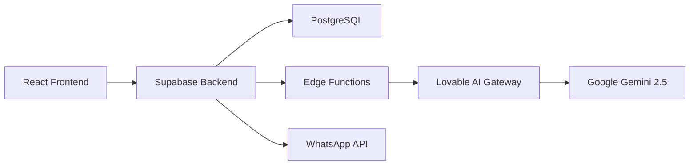

# 🤖 WhatsApp AI Automation Platform

> **Automatize conversas WhatsApp em escala com Inteligência Artificial**

Plataforma completa para prospecção, qualificação e engajamento de leads através do WhatsApp, utilizando agentes de IA personalizáveis que conduzem conversas naturais e inteligentes.

[](https://react.dev)
[](https://www.typescriptlang.org)
[](https://supabase.com)
[](https://lovable.dev)

---

## ✨ Funcionalidades

### 🎯 Gestão de Leads
- ✅ Importação em massa via CSV
- ✅ Segmentação e filtros avançados
- ✅ Histórico completo de interações
- ✅ Status personalizáveis (Contatado, Em Conversa, Convertido)

### 🤖 Agentes de IA Personalizáveis
- ✅ Configure personalidade, tom e objetivos
- ✅ Contexto e conhecimento base
- ✅ Perguntas de qualificação customizadas
- ✅ Suporte a múltiplos agentes simultâneos

### 📱 Gerenciamento WhatsApp
- ✅ Múltiplos números conectados
- ✅ Monitoramento de status e limites
- ✅ Rastreamento de mensagens enviadas

### 🎯 Campanhas Inteligentes
- ✅ Criação de campanhas segmentadas
- ✅ Controle de execução (play/pause)
- ✅ Métricas em tempo real
- ✅ Tipos: Prospecção, Engajamento, Reativação

### 📊 Analytics e Relatórios
- ✅ Dashboard com métricas principais
- ✅ Histórico de conversas
- ✅ Taxa de conversão
- ✅ Performance por agente

---

## 🚀 Quick Start

### Pré-requisitos
- Node.js 18+ 
- Conta Lovable (para backend Supabase)

### Instalação

```bash
# Clone o repositório
git clone <YOUR_GIT_URL>
cd <YOUR_PROJECT_NAME>

# Instale as dependências
npm install

# Execute em desenvolvimento
npm run dev
```

Acesse: `http://localhost:5173`

### Primeiro Acesso
1. Registre-se em `/auth`
2. O primeiro usuário se torna **admin** automaticamente
3. Importe seus leads via CSV
4. Crie seu primeiro agente de IA
5. Lance sua primeira campanha! 🎉

---

## 🏗️ Arquitetura



**Stack Principal**:
- **Frontend**: React 18 + TypeScript + Tailwind CSS
- **Backend**: Supabase (PostgreSQL, Auth, Realtime, Edge Functions)
- **IA**: Lovable AI Gateway (Gemini 2.5 Flash)
- **Deploy**: Lovable Cloud (automático)

---

## 📖 Documentação

- 📚 [Documentação Técnica Completa](./DOCUMENTATION.md)
- 🔄 [Changelog](./CHANGELOG.md)
- 🌐 [Lovable Project](https://lovable.dev/projects/9a8660a2-1e0e-486c-9623-1f36c5e8a2e7)

---

## 🔧 Tecnologias

<table>
<tr>
<td><strong>Frontend</strong></td>
<td>
React 18.3, TypeScript, Vite, Tailwind CSS, shadcn/ui, React Query (TanStack), React Router DOM, Zod
</td>
</tr>
<tr>
<td><strong>Backend</strong></td>
<td>
Supabase (PostgreSQL + RLS), Edge Functions (Deno), Lovable AI Gateway
</td>
</tr>
<tr>
<td><strong>Inteligência Artificial</strong></td>
<td>
Google Gemini 2.5 Flash (via Lovable AI), OpenAI GPT-5 (opcional)
</td>
</tr>
<tr>
<td><strong>Deploy</strong></td>
<td>
Lovable Cloud (automático), Vercel/Netlify (alternativas)
</td>
</tr>
</table>

---

## 🛠️ Comandos Disponíveis

```bash
# Desenvolvimento
npm run dev          # Inicia servidor de desenvolvimento

# Build
npm run build        # Build para produção
npm run preview      # Preview do build

# Qualidade de Código
npm run lint         # Executa ESLint
```

---

## 🤝 Contribuindo

Contribuições são bem-vindas! Por favor:

1. Fork o projeto
2. Crie uma branch para sua feature (`git checkout -b feature/AmazingFeature`)
3. Commit suas mudanças (`git commit -m 'Add: amazing feature'`)
4. Push para a branch (`git push origin feature/AmazingFeature`)
5. Abra um Pull Request

**Padrão de Commits**: [Conventional Commits](https://www.conventionalcommits.org/)

---

## 📝 Roadmap

- [ ] **Q1 2025**: Integração real com WhatsApp Business API
- [ ] **Q1 2025**: Templates de mensagens personalizados
- [ ] **Q2 2025**: Dashboard avançado com mais métricas
- [ ] **Q2 2025**: A/B Testing de agentes IA
- [ ] **Q3 2025**: App mobile (React Native)
- [ ] **Q3 2025**: Integrações com CRMs (Salesforce, HubSpot)

---

## 🔒 Segurança

- ✅ Row Level Security (RLS) em todas as tabelas
- ✅ JWT tokens com auto-refresh
- ✅ Secrets criptografados
- ✅ HTTPS obrigatório
- ✅ Rate limiting em Edge Functions

Reporte vulnerabilidades: security@<your-domain>.com

---

## 📄 Licença

Este projeto está sob a licença MIT. Veja o arquivo LICENSE para mais detalhes.

---

## 🌟 Deploy

### Lovable Cloud (Recomendado)

1. Acesse seu [Projeto Lovable](https://lovable.dev/projects/9a8660a2-1e0e-486c-9623-1f36c5e8a2e7)
2. Clique em **Publish** no canto superior direito
3. Seu app estará disponível em: `<your-subdomain>.lovable.app`

### Domínio Customizado

Para conectar um domínio próprio:
1. Vá em **Project → Settings → Domains**
2. Clique em **Connect Domain**
3. Siga as instruções de configuração DNS

Leia mais: [Configurando domínio customizado](https://docs.lovable.dev/features/custom-domain)

---

## 🆘 Suporte

- 📚 [Documentação Técnica](./DOCUMENTATION.md)
- 💬 [Lovable Discord](https://discord.com/channels/1119885301872070706)
- 📖 [Lovable Docs](https://docs.lovable.dev)
- 📧 Email: support@<your-domain>.com

---

## 👥 Equipe

Desenvolvido com ❤️ pela equipe de desenvolvimento.

---

## 🌟 Dê uma Star!

Se este projeto te ajudou, considere dar uma ⭐ no GitHub!

---

**Última atualização**: 2025-10-18 | **Versão**: 1.0.0
